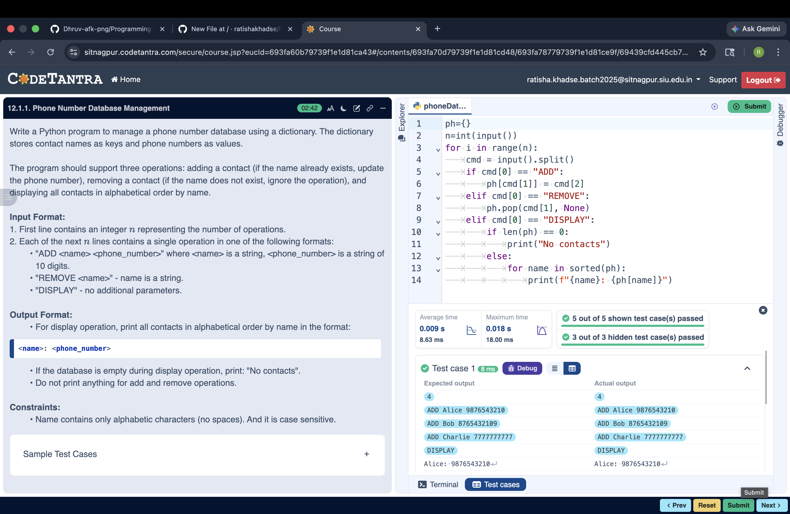

## Problem Statement
Write a Python program to manage a phone number database using a dictionary. The dictionary stores contact names as keys and phone numbers as values.

---

## Algorithm
1.Start

2.Create empty dictionary

3.Read number of operations

4.For each operation:

  If ADD → insert contact
  
  If REMOVE → delete contact
  
  If DISPLAY → print all contacts (sorted) or "No contacts"
  
5.Stop

---

## Flowchart

---

## Execution

  

