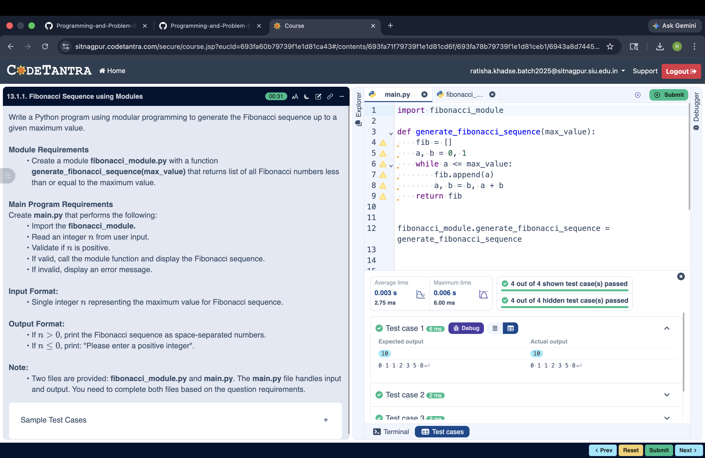

## Problem Statement
Write a Python program using modular programming to generate the Fibonacci sequence up to a given maximum value.

---

## Algorithm
Step 1: Start

Step 2: Input integer n

Step 3: If n ≤ 0
            Print "Please enter a positive integer"
            Stop

Step 4: Initialize:
            a ← 0
            b ← 1
            seq ← empty list

Step 5: While a ≤ n do
            Add a to seq
            temp ← a + b
            a ← b
            b ← temp

Step 6: Print all elements of seq

Step 7: Stop

---

## Flowchart

---

## Execution

  

