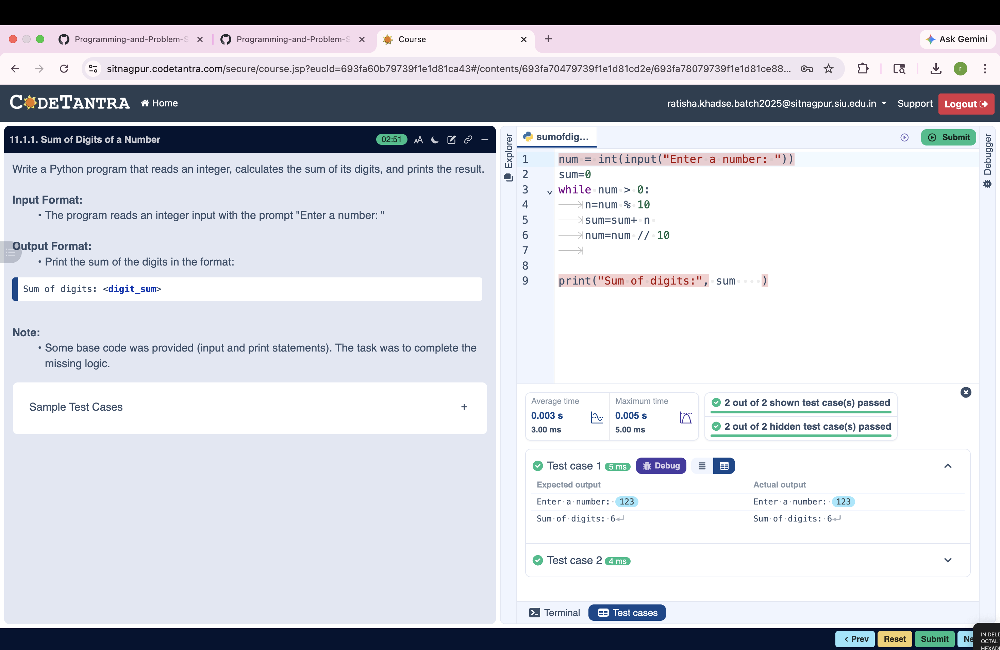

## Problem Statement
Write a recursive function sum_of_digits_recursive(n) that calculates the sum of the digits of a given non-negative integer 

---

## Algorithm
1.Start

2.Read number n

3.If n == 0 → return 0

4.Else → return last digit + recursive call

5.Call function

6.Print result

7.Stop

---

## Flowchart

---

## Execution

  

