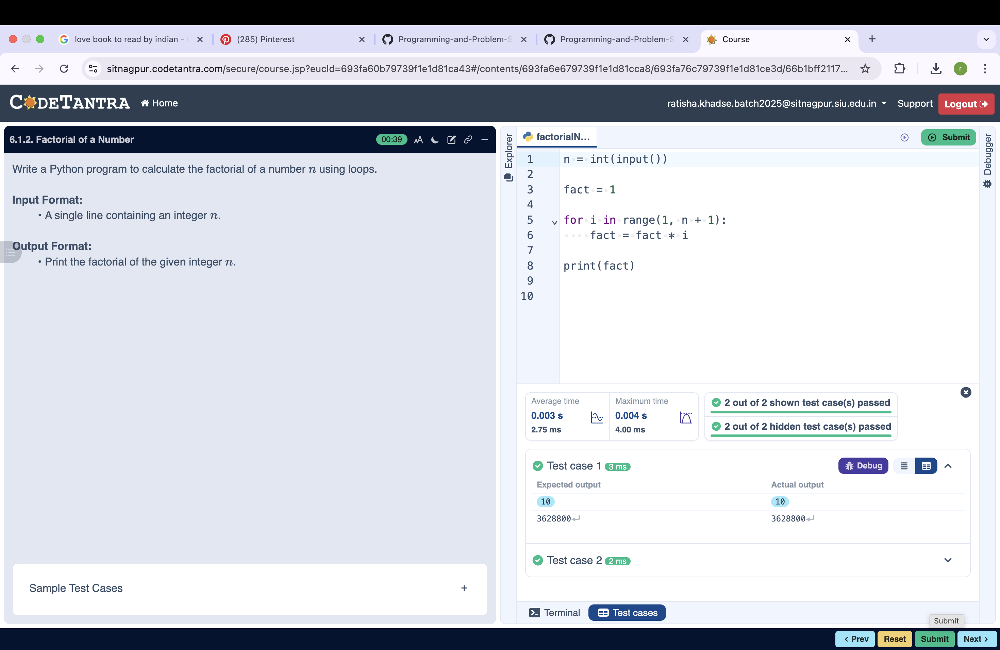

## Problem Statement
Write a Python program to check if a given date is valid. If the date is valid, print the next day's date (incremented date). If the date is invalid, print "Invalid Date".

---

## Algorithm
1. Start.  
2. Read day, month, and year from the user.
3. If year ≤ 0
      → Print "Invalid Date"
      → Stop
4. If month < 1 OR month > 12
      → Print "Invalid Date"
      → Stop
5. If (year % 400 == 0)
      → Set leap = True
6. Else if (year % 100 == 0)
      → Set leap = False
7. Else if (year % 4 == 0)
      → Set leap = True
8. Else
      → Set leap = False
9. If month is 1, 3, 5, 7, 8, 10, or 12
      → Set max_day = 31
10. Else if month is 4, 6, 9, or 11
      → Set max_day = 30
11. Else if month == 2
      → If leap == True
      → Set max_day = 29
      → Else
      → Set max_day = 28
11. If day < 1 OR day > max_day
      → Print "Invalid Date"
      → Stop
12. Increment day by 1
13. If day > max_day
      → Set day = 1
      → Increment month by 1
14. If month > 12
      → Set month = 1
      → Increment year by 1
15. Print "Next Date is: day/month/year"
16. Stop.
---

## Flowchart

  

  

